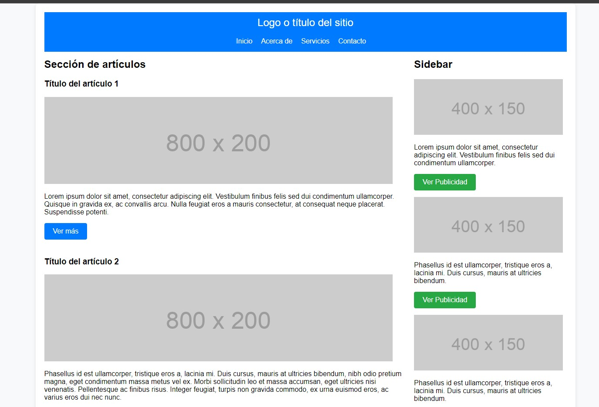

# Mini Blog con HTML5 y CSS

Este es un mini blog básico desarrollado con HTML5 y CSS. El proyecto incluye una página web con etiquetas semánticas y un diseño simple.

## Contenido del Proyecto

- **index.html**: Archivo HTML principal que representa la estructura básica del mini blog.
- **style.css**: Archivo CSS para estilizar la página HTML.
- **html5.png**: Icono del sitio.
- **imagen/**: Carpeta que contiene imágenes utilizadas en la página, como capturas de pantalla.

# CAPTURAS DE PANTALLA:



## Estructura de la Página

La página HTML utiliza etiquetas semánticas y un diseño responsivo:

- El `<header>` contiene la cabecera del mini blog con un enlace al "Logo o título del sitio" y una barra de navegación.
- El contenido principal se encuentra dentro de un `<article>` y presenta varios artículos con imágenes y texto.
- El `<aside>` actúa como una barra lateral y contiene anuncios publicitarios y un reproductor de video de ejemplo.
- El `<footer>` contiene el pie de página del sitio.

### Link Pagina: https://juancitopena.github.io/QUINTO_PROYECTO_TIPO_PLANTILLA_MINI_BLOG_HTML5_Y_CSS3/

## Cómo Usar

1. Clona este repositorio en tu máquina local:

```bash
git clone https://github.com/tuusuario/Mini-Blog-HTML5-CSS.git
